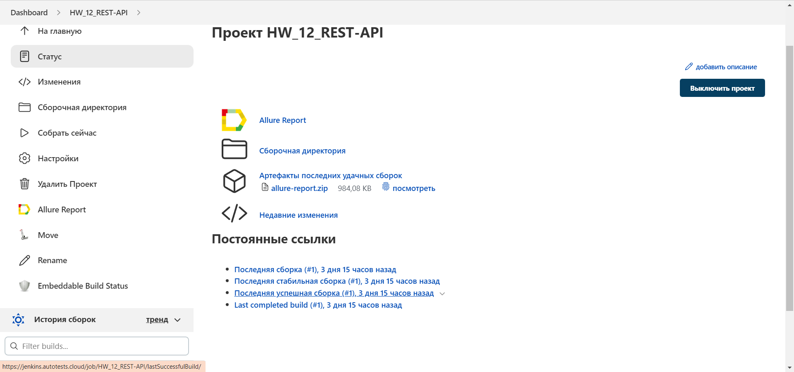
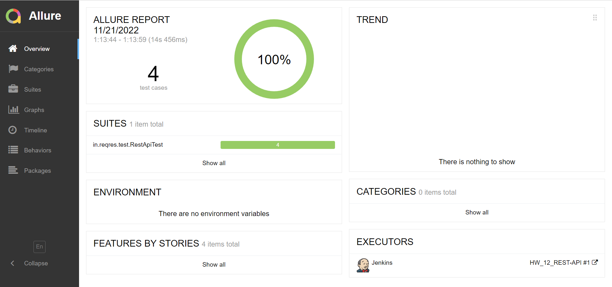
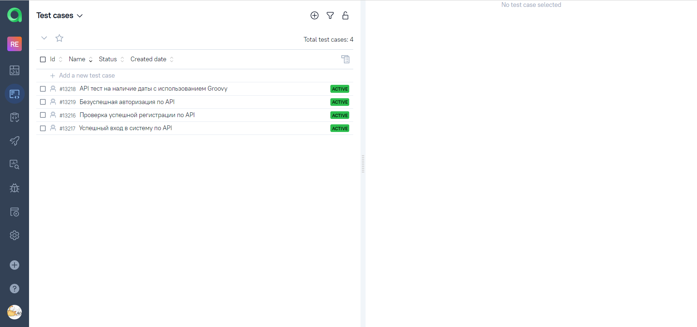
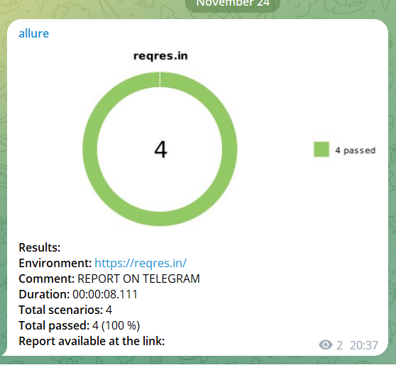

# Дипломный проект по автоматизации тестирования API на тестовом сайте <a target="_blank" href="https://reqres.in/">reqres.in</a>.

## :memo: Содержание:

- [Реализованные проверки](#boom-Реализованные-проверки)
- [Технологии](#classical_building-Технологии)
- [Сборка в Jenkins](#man_cook-Jenkins-job)
- [Allure отчет](#bar_chart-Allure-отчет)

## :boom: Реализованные проверки

- ✓ Регистрация пользователя
- ✓ Авторизация пользователя
- ✓ Авторизация без пароля
- ✓ Проверка наличия даты у item с использованием Groovy


## :classical_building: Технологии
<p align="center">


</p>

## :man_cook: Jenkins job
</a>  <a target="_blank" href="https://jenkins.autotests.cloud/job/HW_12_REST-API/">Jenkins job</a>
<p align="center">
<a href=""></a>
</p>


###  Локальный запуск:
```
gradle clean test
```

## :bar_chart: Allure-отчет
</a> Отчет в <a target="_blank" href="https://jenkins.autotests.cloud/job/HW_12_REST-API/allure/">Allure report</a>
<p align="center">
<a href=""></a>
</p>

## :bar_chart: Интеграция с Allure TestOps

</a> Отчет в <a target="_blank" href="https://allure.autotests.cloud/project/1710/dashboards">Allure TestOps</a>
<p align="center">
<a href=""></a>
<a href=""></a>
</p>

##  Отчёт в telegram

<a href=""></a>